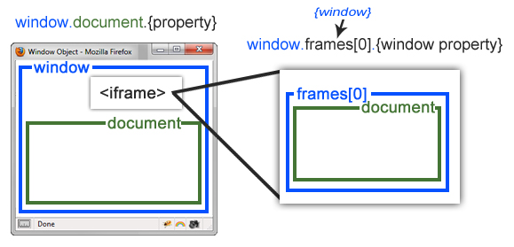

# Three.js Journey

## Setup
Download [Node.js](https://nodejs.org/en/download/).
Run this followed commands:

``` bash
# Install dependencies (only the first time)
npm install

# Run the local server at localhost:8080
npm run dev

# Build for production in the dist/ directory
npm run build
```

## Notes: different between window, document and screen

Window is like a root for everything, document and screen are children of the window.


Canvas, iframe or else they will be containing the document.

